# THE SASQUATCH QUIZ

## Outline

The Sasquatch Quiz is a multiple choice quiz site testing knowledge on the subject of sasquatch/bigfoot/the North American Wood Ape. Most of the questions are medium to high level difficulty - it's a quiz for people with a fairly deep interest in the subject matter rather than for beginners.

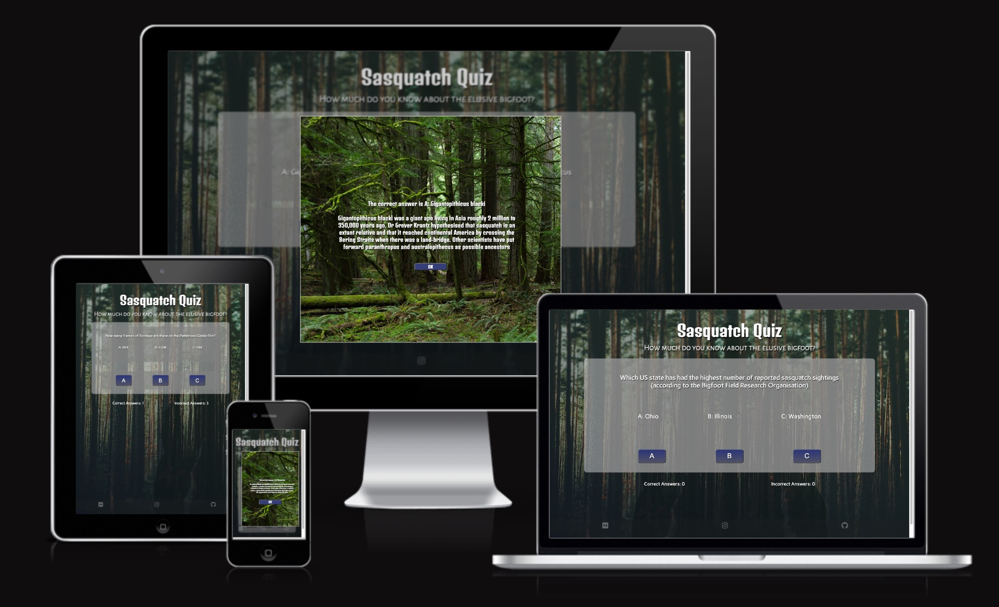

# Live site

<https://caketaster.github.io/Portfolio-Project-2/>

# Repository

<https://github.com/caketaster/Portfolio-Project-2>

# Author

Benjamin Norman  
<https://github.com/caketaster>

# Table of Contents

- [THE SASQUATCH QUIZ](#the-sasquatch-quiz)
  - [Outline](#outline)
- [Live site](#live-site)
- [Repository](#repository)
- [Author](#author)
- [Table of Contents](#table-of-contents)
- [UX](#ux)
- [Target Audience](#target-audience)
- [Project Goals](#project-goals)
- [User Stories](#user-stories)
- [Design Choices](#design-choices)
  - [Wireframes](#wireframes)
  - [Colours](#colours)
  - [Typography](#typography)
  - [Imagery](#imagery)
- [Site Structure](#site-structure)
- [Features](#features)
  - [Implemented Features](#implemented-features)
    - [Homepage](#homepage)
  - [Future Features](#future-features)
- [Testing](#testing)
  - [User Testing](#user-testing)
- [Validation Testing](#validation-testing)
  - [CSS Validation](#css-validation)
  - [HTML Validation](#html-validation)
  - [Compatibility and Responsive Testing](#compatibility-and-responsive-testing)
  - [Lighthouse testing](#lighthouse-testing)
  - [Wave Testing](#wave-testing)
- [Deployment](#deployment)
  - [Production](#production)
- [Credits](#credits)
  - [Technologies used](#technologies-used)
  - [Media](#media)

# UX

# Target Audience

The target is audience is anyone who's interested in the phenomenon, those who want to learn more about it, plus those who already feel themselves knowledgeable on the subject. The questions are weighted toward experts, though hopefully those newer to the phenomenon can learn something and enjoy themselves too.

# Project Goals

To present a fun and informative quiz in a simple and intuitive way.
To develop my JavaScript, plus HTML and CSS skills, whilst creating a viable and hopefully enjoyable website.

# User Stories

As a site user I want to:

- Test my knowledge of the sasquatch phenomenon in several different areas
- Learn some facts that I previously wasn't aware of
- Have a smooth, intuitive user experience
- Have few or zero issues with readability
- Have fun!

# Design Choices

## Wireframes

Basic wireframes were created for desktop and mobile in Balsamiq, although the final design did change slightly.  
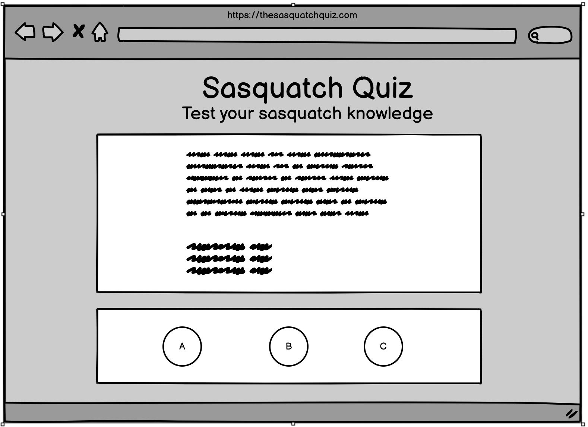 

Showing the info modal upon answer-click 
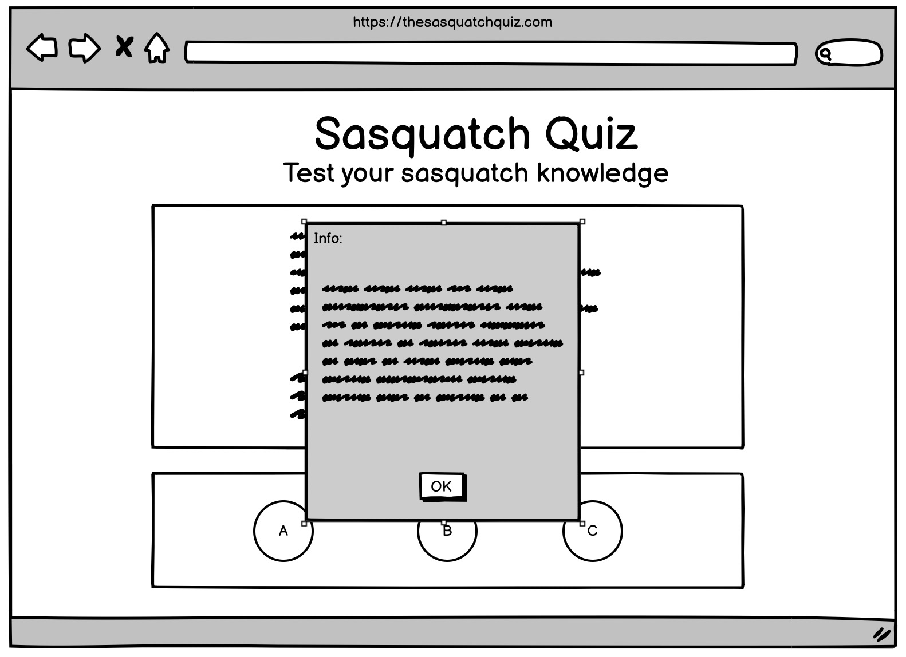 

I also made wireframes for the page on mobile:  
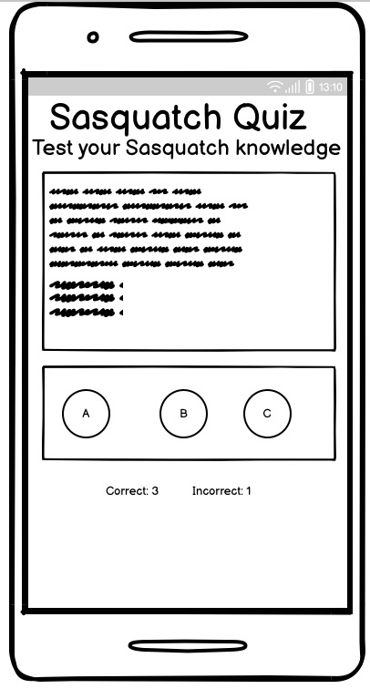

## Colours

I wanted a forest-feel to the backdrop and a basic but colourful layout to the quiz section. The main colours seen are light browns, dark browns and greens due to the background chosen, with [mostly] white text. The modals are a brighter and stronger green. Semi-opaque divs for the question text let the background colours come through whilst still leaving the text easily readable. I used dark blue as a 'trim' as it matches well with the other colours.

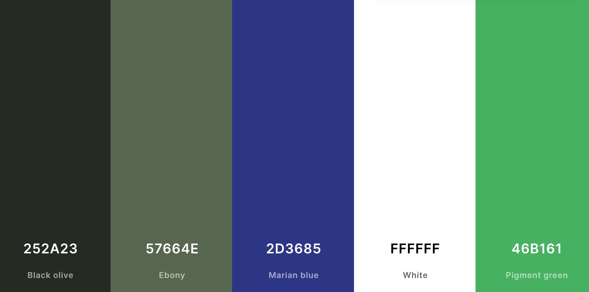

## Typography

I used 3 fonts, Alegreya Sans SC for the main heading and question text, and also the modal text, Denk One for the sub-heading and Carme for the answer text text. Without resorting to a stereotypical cartoonish font I did want something slightly 'fun' for the main heading and modal text, something that elicited a more pre-technological time. I used [Fontjoy](https://fontjoy.com/) to create the pairing. Ultimately I went on feeling as to what fonts would work best and fit the mood of the site. I stayed with white text for easy readability but added a text shadow to make the text clearer on a mixed-colour background.

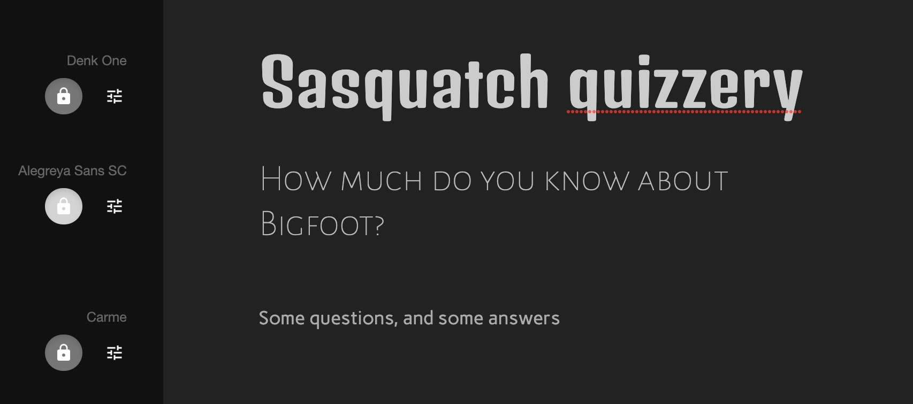

## Imagery

As this is a quiz site I kept the imagery basic. The background has a silhouetted sasquatch in a forest, all images are creative commons or free to use (from Google searches).

The icons all came from [Font Awesome](https://fontawesome.com/).

The favicon icon came from [icons8](https://icons8.com) and aptly shows the subject of the site.

# Site Structure

This is a single page site with modals appearing to introduce the quiz and after each question to give the correct answer and more information, and a final score modal telling you how you've done in the question section you played through.

# Features

## Implemented Features

### Homepage

An intro modal displays on pageload giving a brief introduction and the 3 quiz sections that you can choose from.  
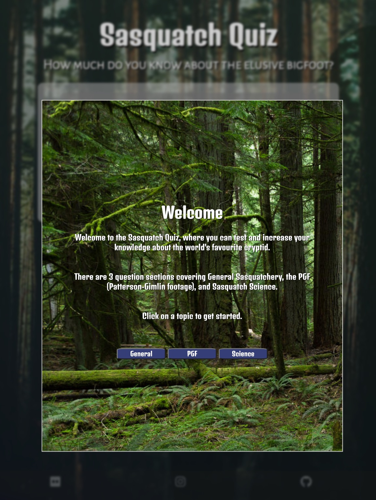  
An overlay blurs the screen background behind each modal (a subtle nod to the blurry photos usually associated with sasquatch) but the blur overlay disappears when each question is displayed. 
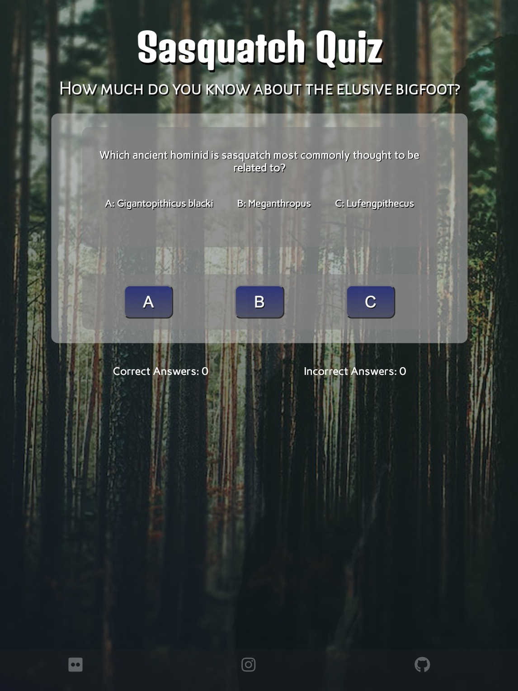  
After each question is answered an info modal appears giving the correct answer and more information about the answer.  
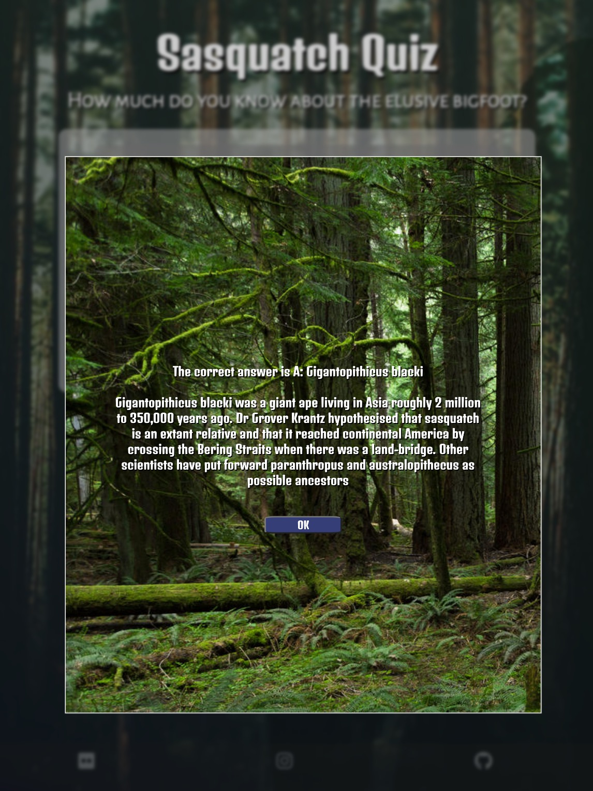  
The score/incorrect score tally increments. On completing your quiz section a final modal appears giving your score and a message. There are separate messages for any score over 4/10 and a single message for scores of 3 and under. On clicking Try Again the page then resets for another turn. 
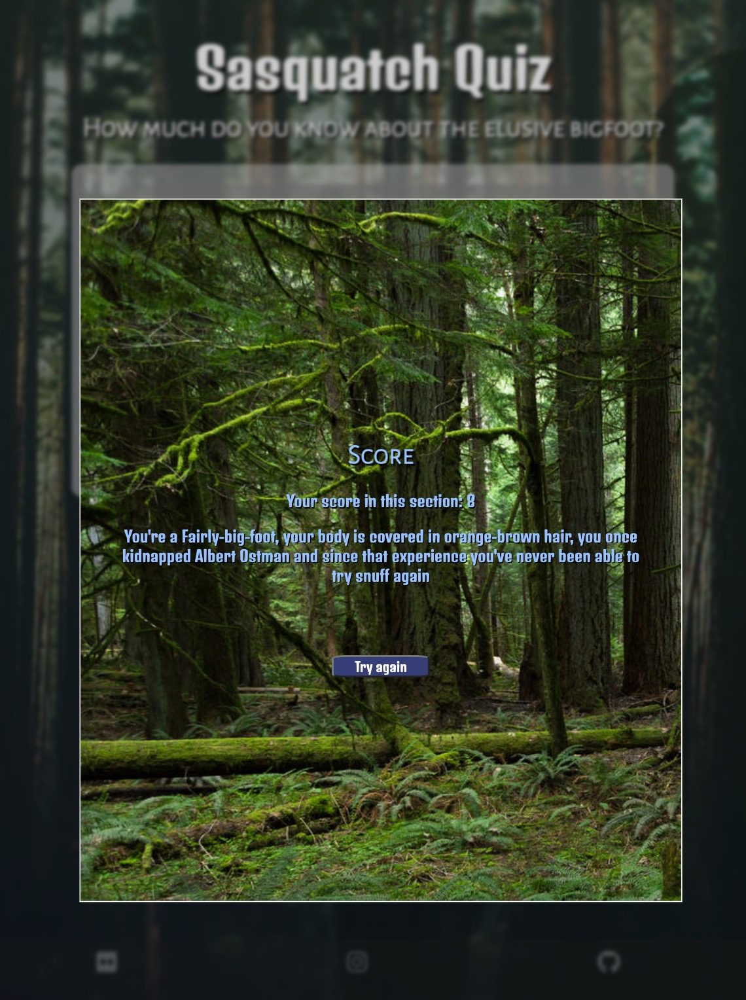  
Socials links glow on hover. 
  

## Future Features

- **Hold name and score for each section**  
  The page could in future hold your score for each section, so you could take each section in turn and get a combined total score.

- **Compile online scores list**  
  Scores could be held in an online database so players could compare how they score against other people who've played elsewhere.

- **New questions added**  
  Each section is currently a little short, and there may not be much re-play value. In order to attract more repeat plays more questions could be added, or even more sections. I'd especially like to add a Beginners question section, with simpler questions based more on sasquatch in popular culture, as more of an on-ramp. I was also considering a Hoaxes section, but couldn't gather enough questions to make it viable.

- **Answers displayed within the buttons**  
  I made a design choice to leave the answer buttons as simply A, B and C and have the answer options display above the buttons. This is helpful for media queries, as the buttons can shrink with few issues as they don't contain any text apart from a single letter each. Possibly the most attractive and intuitive way would be to embed the answers in the buttons, and in future I'd definitely consider changing the format to allow this (perhaps with long vertically stacked buttons, allowing a reasonable amount of text in each).

- **More and Better pictures**  
  Aware of copyright issues, I was conservative in my choice of imagery. I believe better, more descriptive images could have been chosen to increase engagement. Some people, although they've probably seen the Patterson-Gimlin footage, may not be aware that that's what it's called, so a good descriptive photo somewhere would be a major help. The target audience are fully aware of what the PGF is, so in the end it is not a major flaw, but if I were to expand the site to be more beginner friendly it would be a must to add more photos.

- **Images in modals**  
  Again I was mindful of possible copyright issues and of consistency across the site, so did not insert images into the info modals, but images exist that would explain the majority of the answers in a visual way (e.g. the Jerry Crews casts, an image of the Skookum cast, a great-ape skull with a sagittal crest, images of dermal ridges). Inserting one good image into each info modal would be informative and engaging.

- **User feedback page**  
  Including a contact form would enable direct user feedback and submission of new questions, which would help with continuous site improvement, growth and engagement.

- **Better commit messages**  
  In terms of the building of the site, my commit messages were often too long, sometimes not descriptive enough, and I may have strayed from present tense at times. I have room for improvement here.

- **Decrease pageload times**  
  My Lighthouse performance score on mobile was not as high as I'd wish. Although I did take steps to improve it there were other suggestions on the site for improvements that were above my skill level to implement.

- **Extra media queries for edge cases**  
  The site is responsive down to 320px wide (i.e. a Galaxy Fold, the smallest phone on DevTools) and looks relatively good on any larger screen sizes. One of the questions (screenshot below) has too many characters in the answers, and so looks rather squashed on the smallest screen sizes. The simplest fix would be to remove this question and come up with another! Advanced media queries could also be employed to edit the longer text strings ao smaller screens.

  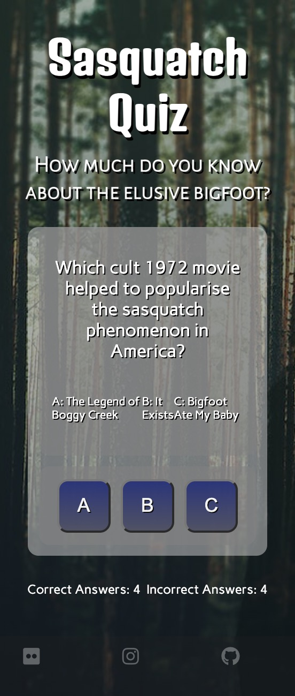

# Testing

Every page looks good on screens as narrow as 320px and as short as 650px (the size of a Galaxy Fold).
The site passes all tests from the following template (adapted for use on my own site)
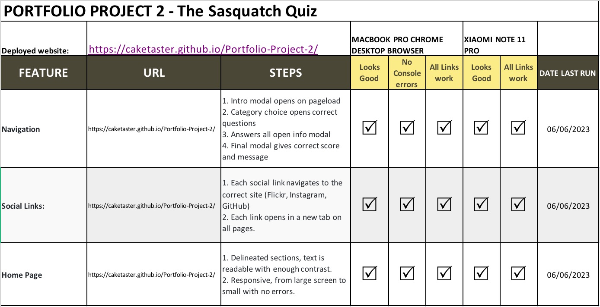

## User Testing

I sent the site to be tested onto a popular bigfoot internet forum. Their feedback is below, and what I did with the feedback:

    Personally the font is really hard to read on the background

I added a text-shadow to almost all text to increase contrast and readability and a linear gradient to the background image to darken it.

    Quite a few slides had buttons with no answers attached to them [iPhone SE user]

Media queries were improved to fix answer text sliding down into the answer buttons, and I inserted code to scale the text along with the screen size.

    The information text was almost too small to read on mobile - I had to strain a bit to read it all.

Modal text size increased in size by 20%.

There were several question suggestions and re-wording suggestions, which I took into account when tidying up the question list. Plus a couple of spelling errors that were picked up by testers.

# Validation Testing

## CSS Validation

No errors were returned when passing through the [official CSS validator](https://jigsaw.w3.org/css-validator/)
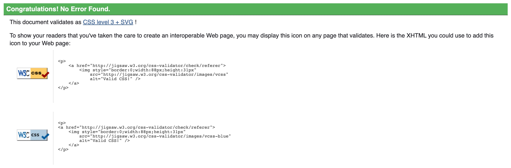

## HTML Validation

No errors were returned when passing through the [official HTML validator](https://validator.w3.org/)
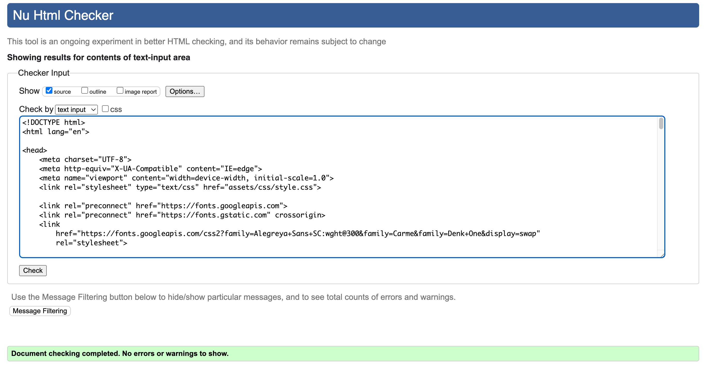

## Compatibility and Responsive Testing

I used [gsstatcounter](https://gs.statcounter.com/) to check the most popular browsers on desktop, tablet and mobile, and the most common screen resolutions seen worldwide:

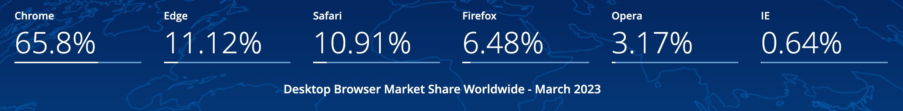 
 
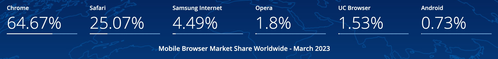 

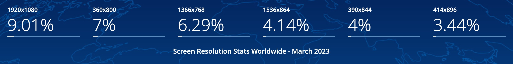 

Testing therefore focused on Chrome at various resolutions. I do not have a Browserstack account so ran through the DevTools emulators and the other browsers I had installed (Safari, Firefox)

| Device                                | Browser                | Operating System   | Screen dimensions                             |
| ------------------------------------- | ---------------------- | ------------------ | --------------------------------------------- |
| Macbook Pro 2014                      | Chrome 112.0.5615.49   | MacOS 10.15.7      | 2560 x 1600px, 3840 x 2160px (second display) |
| Macbook Pro 2014                      | Safari 15.4            | MacOS 10.15.7      | 2560 x 1600px, 3840 x 2160px (second display) |
| Macbook Pro 2014                      | Firefox 109.0.1        | MacOS 10.15.7      | 2560 x 1600px, 3840 x 2160px (second display) |
| RedMi Note 11 Pro                     | Chrome 112.0.5615.48   | MiUI Global 13.0.7 | 1080 x 2400px                                 |
| RedMi Note 11 Pro                     | Mi Browser 17.5.110328 | MiUI Global 13.0.7 | 1080 x 2400px                                 |
| DevTools emulator: iPhone XR          | Chrome 112.0.5615.49   | MacOS 10.15.7      | 414 x 896px                                   |
| DevTools emulator: iPhone 12 Pro      | Chrome 112.0.5615.49   | MacOS 10.15.7      | 390 x 844px                                   |
| DevTools emulator: Samsung Galaxy S8+ | Chrome 112.0.5615.49   | MacOS 10.15.7      | 360 x 740px                                   |
| DevTools emulator: iPad Air           | Chrome 112.0.5615.49   | MacOS 10.15.7      | 820 x 1180px                                  |
| DevTools emulator: iPad Mini          | Chrome 112.0.5615.49   | MacOS 10.15.7      | 768 x 1024px                                  |
| DevTools emulator: Surface Pro 7      | Chrome 112.0.5615.49   | MacOS 10.15.7      | 912 x 1368px                                  |
| DevTools emulator: Galaxy Fold        | Chrome 112.0.5615.49   | MacOS 10.15.7      | 280 x 653px                                   |
| DevTools emulator: Nest Hub           | Chrome 112.0.5615.49   | MacOS 10.15.7      | 1024 x 600px                                  |

No issues were observed testing on Mi Browser or Safari.
Given the chance I'd want to test in other browsers (Opera, Samsung, Edge).

## Lighthouse testing

All testing was performed on an Incognito page in Chrome.

Homepage (desktop) 
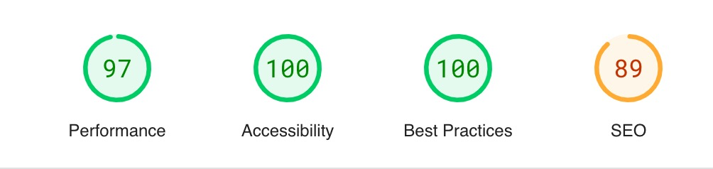 
Homepage (mobile) 
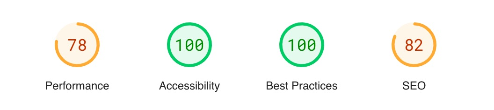 

Performance on mobile was originally a disappointing 72. The main issue seemed to be loading times for the background and intro-modal images, so I converted them from jpg to webp and moved the background image styling into the HTML as inline CSS. Following these changes I got the score up to 78 - still not very high, and an area for improvement.

## Wave Testing

I ran the site through [Wave](https://wave.webaim.org/) and the site returned the following summary, plus details:

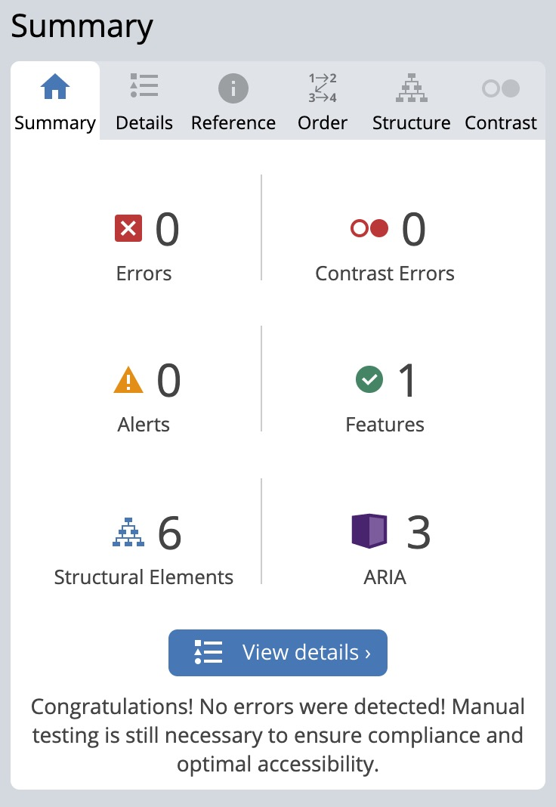 
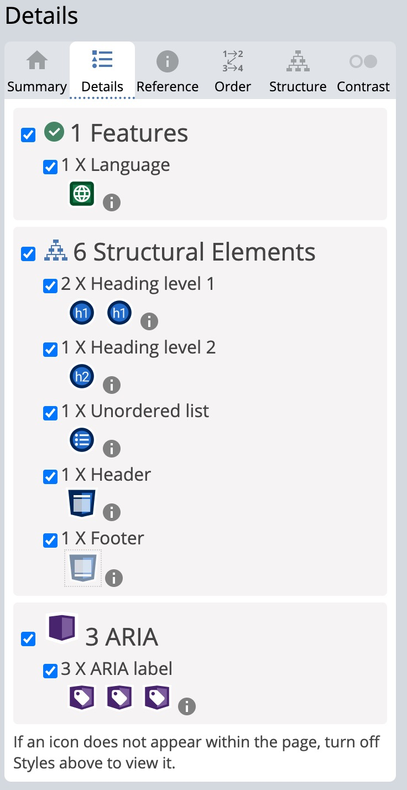 
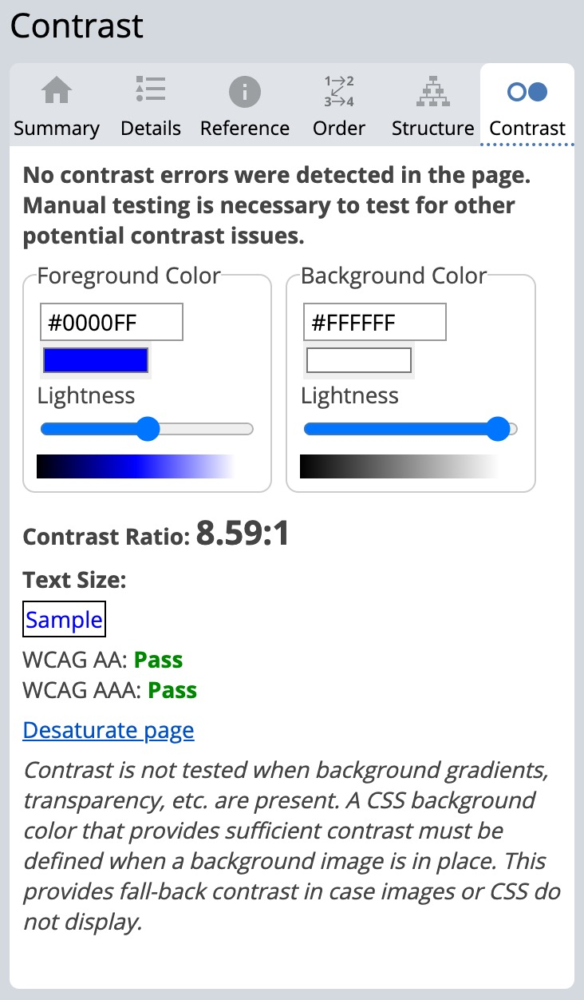 

# Deployment

## Production

This website was deployed to GitHub Pages.
The following steps were taken to deploy:

1. Click the Settings cog on GitHub  
   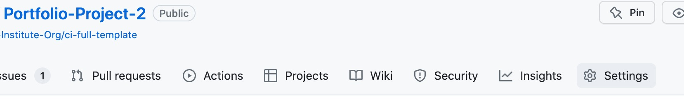

2. In the left-hand nav, click on the Pages tab  
   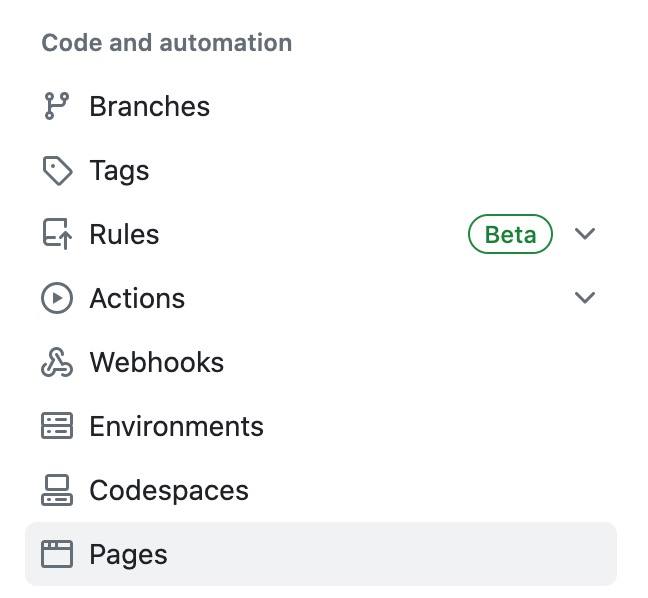

3. In the Branches section, select Main  
   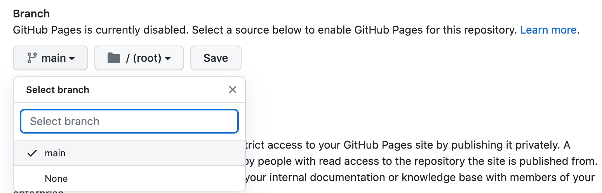

4. Click Save  
   

5. Site is now deployed  
   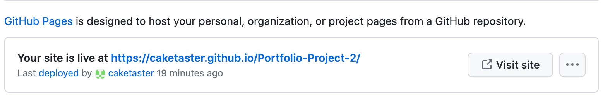

# Credits

The JS quiz functions were adapted and amalgamated from the following web tutorials and Portfolio 2 submissions, and checked and polished in collaboration with an online tutor from Preply.com

- [How to Make a Simple JavaScript Quiz](https://www.sitepoint.com/simple-javascript-quiz/)
- [PP2 submission - Animal Quiz](https://github.com/KateEllen/Animal-Quiz/blob/main/assets/js/script.js)
- [Code Geek - Create a Quiz App using HTML, CSS & JavaScript](https://www.youtube.com/watch?v=Opje9VBrNfg&t=1791s&ab_channel=CodeGeek)
- [Easy Tutorials - How To Make Quiz App Using JavaScript](https://www.youtube.com/watch?v=PBcqGxrr9g8&ab_channel=EasyTutorials)
- [How to Make a Quiz App using HTML CSS Javascript - Vanilla Javascript Project for Beginners Tutorial](https://www.youtube.com/watch?v=f4fB9Xg2JEY&ab_channel=BrianDesign)

JS/CSS sites that I used:

- [How to create the intro modal](https://www.freecodecamp.org/news/how-to-build-a-modal-with-javascript/)
- [Vertically centre text](https://stackoverflow.com/questions/2939914/how-do-i-vertically-align-text-in-a-div)
- [Add text-shadow](https://www.w3schools.com/csS/css3_shadows.asp)
- [Responsive scaling text](https://sjorswijsman.medium.com/3-easy-css-tricks-for-responsive-websites-i-use-in-every-project-68ec334a1522)
- [How to create a fixed footer](https://www.w3schools.com/howto/howto_css_fixed_footer.asp)

## Technologies used

The site was built using HTML, CSS and vanilla JavaScript coding languages.

## Media

All photos were taken from Google Images, searching by license for Creative Commons images.
