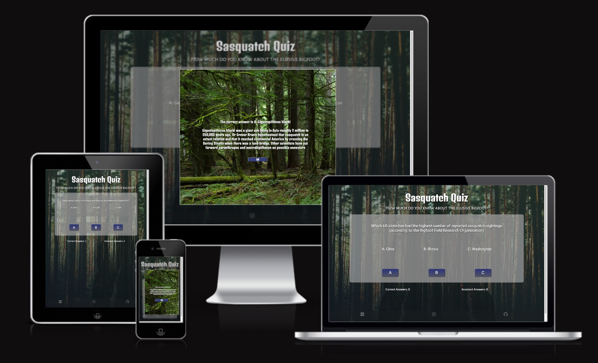
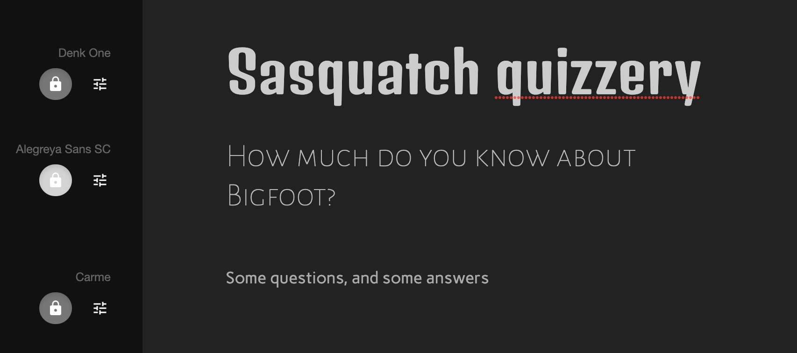
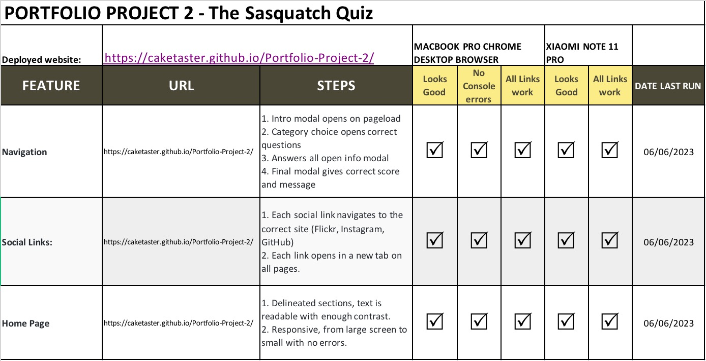
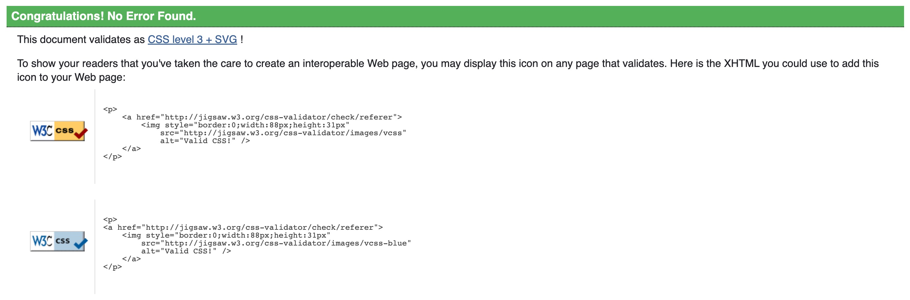
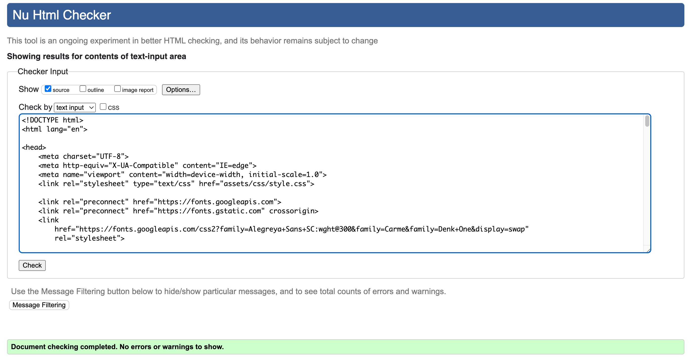
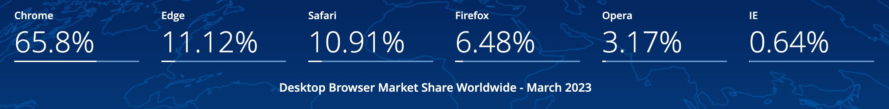
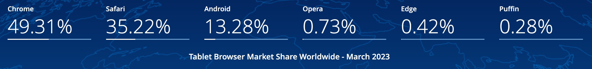
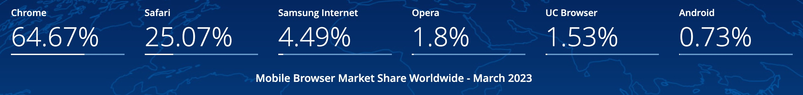
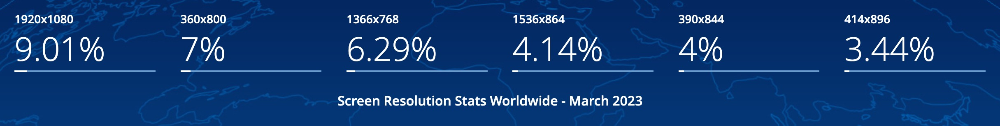

# THE SASQUATCH QUIZ

## Outline

The Sasquatch Quiz is a multiple choice quiz site testing knowledge on the subject of sasquatch/bigfoot/the North American Wood Ape. Most of the questions are medium to high level although some are far easier. so that almost everyone will be able to get a few right but only true devotees of the subject will get very high scores .

# Live site

...

# Repository

<https://github.com/caketaster/Portfolio-Project-2>

# Author

Benjamin Norman  
<https://github.com/caketaster>

# Table of Contents

<small><i><a href='http://ecotrust-canada.github.io/markdown-toc/'>Table of contents generated with markdown-toc</a></i></small>

# UX

# Target Audience

The target is audience is anyone who's interested in the phenomenon, those who want to learn more about it, plus those who already feel themselves knowledgeable on the subject.

# Project Goals

To present a fun and informative quiz in a simple and intuitive way.
To develop my JavaScript, plus HTML and CSS skills, whilst creating a viable and hopefully enjoyable website.

# User Stories

As a site user I want to:

- Test my knowledge of the sasquatch phenomenon
- Learn some facts that I previously wasn't aware of
- Have fun!

# Design Choices

## Colours

I wanted a forest-feel to the backdrop and a basic but colourful layout to the quiz section. The main colours seen ire light browns, dark browns and greens, due to the background chosen. Semi-opaque divs let the colour come through whilst still leaving the test easily readable.

## Typography

I used 3 fonts, Alegreya Sans SC for the main heading, Denk One for the sub-heading and Carme for the main body text. Without resorting to a stereotypical cartoonish font I did want something slightly 'fun' for the main heading. I used [Fontjoy](https://fontjoy.com/) to create the pairing. Ultimately I went on feeling as to what fonts would work best and fit the mood of the site. I stayed with white text for easy readability.

## Imagery

As this is a quiz site I kept the imagery basic. The background has a silhouetted sasquatch, all images are creative commons or free to use.

The icons all came from [Font Awesome](https://fontawesome.com/). I wanted to keep a consistent dark theme for the icons.

The favicon icon came from [**\_\_\_**]() and aptly shows the subject of the site.

## Animations and Transitions

# Site Structure

This is a single page site,

# Wireframes

Basic wireframes were created for desktop and mobile in Balsamiq, although the final design and function did change.  
 

I also made wireframes for the page on mobile:  

# Features

## Implemented Features

### Homepage

...

### Thank you page

The form redirects to a static Thank you page with a clickable message (reading 'thank you') that returns you to the home page, plus a short message on responding to enquiries. This link shares the same style and glow as the logo text.

### 404 page

404 page created with a link back to the home page, as per the Thank you page.

## Future Features

- **Click Image for Full Screen Overlay**  
  I would love the images to expand to full-screen on being clicked (or possibly when hovered over),

- **Auto populate contact form with image of interest**  
  I'd like to add a UX component to add selected images to the contact form. A user could click on each image they were interested in and the image numbers would populate the contact form. This would save the user having to remember specific image numbers before filling the contact form in. I believe this would involve javascript abilities that I do not yet possess.

- **Contact form to have a different focus for different users**  
  From user feedback, I realised that a possible future improvement would be a contact page with subsections depending on the nature of the query - one more sales-focused (with print sizes, paper quality, pricing etc.) and another closer to what's presented now - a form with a simple text area for general contact.

- **Play with Gallery choices**  
  The numbers that appear on hover in the Gallery sometimes do not sit nicely on the images (in the tablet screen size in particular), and this is something that could be improved. If all images had the same aspect ratio this could be solved relatively easily, in future I would consider separate galleries depending on aspect ratio, which would make this issue simpler to work on, and give users choice based on image layout (for printing etc). Having a gallery-style where the column number would shrink with the screen size could also mitigate this issue - something I could implement in future.

- **Extra media queries for edge cases**  
  All pages are responsive down to 320px wide (which very few modern phones are) and look good on any larger screen sizes (although the contact page starts to look slightly spare above approximately 1500px wide - though all functionality is retained). As a future feature I could set a media query for extra-wide screens that would mitigate the expanse of space on the screen on extra-wide monitors.
  The pages also don't look ideal on very small mobile screens, this could be improved upon.

- **Optimise Gallery image sizes**  
  The gallery can be slow to load, due to large image sizes. This is a trade-off - I want to show images in high quality, but the larger the image (and the more images I have), the slower they will load. I chose to stick with large images in my assets folder but use jpg, as a relatively compact file size. I have cut the image sizes to be no larger than 300kb per photo, though this is probably still excessive. In future I could tweak this to optimise speed whilst keeping quality at a relatively high level, or split the gallery onto different pages depending on subject, format, camera and so on to have shorter loading times per page.

# Testing

Every page looks good on screens as narrow as 320px and as short as 700px.
The site passes all tests from the following template (adapted for use on my own site)

## User Testing

I sent the site to be tested by a few photography friends. Their feedback is below, and what I did (if anything) with the feedback:

# Validation Testing

## CSS Validation

No errors were returned when passing through the official HTML validator

<https://jigsaw.w3.org/css-validator/>

## HTML Validation

No errors were returned when passing through the official HTML validator

<https://validator.w3.org/>

## Compatibility and Responsive Testing

I used [gsstatcounter](https://gs.statcounter.com/) to check the most popular browsers on desktop, tablet and mobile, and the most common screen resolutions seen worldwide:

 
 
 

 

Testing therefore focused on Chrome at various resolutions. I do not have a Browserstack account so ran through the DevTools emulators and the other browsers I had installed (Safari, Firefox)

| Device                                | Browser                | Operating System   | Screen dimensions                             |
| ------------------------------------- | ---------------------- | ------------------ | --------------------------------------------- |
| Macbook Pro 2014                      | Chrome 112.0.5615.49   | MacOS 10.15.7      | 2560 x 1600px, 3840 x 2160px (second display) |
| Macbook Pro 2014                      | Safari 15.4            | MacOS 10.15.7      | 2560 x 1600px, 3840 x 2160px (second display) |
| Macbook Pro 2014                      | Firefox 109.0.1        | MacOS 10.15.7      | 2560 x 1600px, 3840 x 2160px (second display) |
| RedMi Note 11 Pro                     | Chrome 112.0.5615.48   | MiUI Global 13.0.7 | 1080 x 2400px                                 |
| RedMi Note 11 Pro                     | Mi Browser 17.5.110328 | MiUI Global 13.0.7 | 1080 x 2400px                                 |
| DevTools emulator: iPhone XR          | Chrome 112.0.5615.49   | MacOS 10.15.7      | 414 x 896px                                   |
| DevTools emulator: iPhone 12 Pro      | Chrome 112.0.5615.49   | MacOS 10.15.7      | 390 x 844px                                   |
| DevTools emulator: Samsung Galaxy S8+ | Chrome 112.0.5615.49   | MacOS 10.15.7      | 360 x 740px                                   |
| DevTools emulator: iPad Air           | Chrome 112.0.5615.49   | MacOS 10.15.7      | 820 x 1180px                                  |
| DevTools emulator: iPad Mini          | Chrome 112.0.5615.49   | MacOS 10.15.7      | 768 x 1024px                                  |
| DevTools emulator: Surface Pro 7      | Chrome 112.0.5615.49   | MacOS 10.15.7      | 912 x 1368px                                  |
| DevTools emulator: Galaxy Fold        | Chrome 112.0.5615.49   | MacOS 10.15.7      | 280 x 653px                                   |
| DevTools emulator: Nest Hub           | Chrome 112.0.5615.49   | MacOS 10.15.7      | 1024 x 600px                                  |

On Safari on desktop the menu nav bar responds differently to Chrome. When hovered, each menu item shifts the position of its neighbours slightly (although there is no effect on functionality). The Gallery also renders as one long vertical column, even on wider screens.

On Galaxy Fold there is a warning message saying the device is not suitable for viewing the page optimally, but the page does work fine, despite the contact form and social links being a little close.

Given the chance, and particularly as the Gallery on Safari responds differently to on Chrome, I'd want to test in other browsers (Opera, Samsung, Edge)

## Lighthouse testing

All testing was performed on an Incognito page in Chrome. Although Performance can vary, the largest issue was the Gallery performance on both mobile and desktop, due to the amount of large, fairly high quality images. To mitigate this I reduced the sizes of all the larger images and increased Performance scores by 16 and 24 respectively, but further trimming of size would also help these scores.

Homepage (desktop) 
 
Homepage (mobile) 
 

Gallery (desktop) 
 
Gallery (mobile) 
 

Contact page (desktop) 
 
Contact page (mobile) 
 

Thank you page (desktop) 
 
Thank you page (mobile) 
 

404 page (desktop) 
 
404 page (mobile) 
 

## Wave Testing

I ran the site through [Wave](https://wave.webaim.org/) and the site returned

# Defects

I did not track my defects as often as I should have at this early stage, but [the following defects were tracked and closed](https://github.com/caketaster/Portfolio-Project-1---still-life/issues)

## Outstanding Defects

# Deployment

## Production

This website was deployed to GitHub Pages.
The following steps were taken to deploy:

1. Click the Settings cog on GitHub  
   

2. In the left-hand nav, click on the Pages tab  
   

3. In the Branches section, select Main  
   

4. Click Save  
   

5. Site is now deployed  
   

# Credits

I used the Love-Maths walkthrough project as a

- [Nav bar](https://learn.codeinstitute.net/courses/course-v1:CodeInstitute+LR101+2021_T1/courseware/4a07c57382724cfda5834497317f24d5/637be1a2e3b84b25aa33f3ab4d98603c/)
- [Hero-image zoom](https://learn.codeinstitute.net/courses/course-v1:CodeInstitute+LR101+2021_T1/courseware/4a07c57382724cfda5834497317f24d5/6fd29d155c3b42248ff57bae32978a4b/)
- [contact form](https://learn.codeinstitute.net/courses/course-v1:CodeInstitute+LR101+2021_T1/courseware/4a07c57382724cfda5834497317f24d5/4d85cd1a2c57485abbd8ccec8c00732c/)

I used W3schools for several things too:

- [hover boxes on gallery](https://www.w3schools.com/cssref/sel_hover.php)
- [larger textarea in the contact form](https://www.w3schools.com/tags/tag_textarea.asp)
- [placholder styling](https://www.w3schools.com/howto/tryit.asp?filename=tryhow_css_placeholder)

## Media

All photos were taken from Google Images, searching by license for Creative Commons images.
